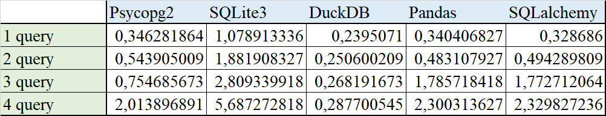
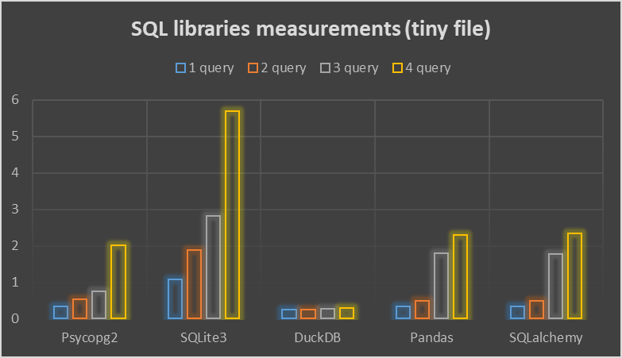
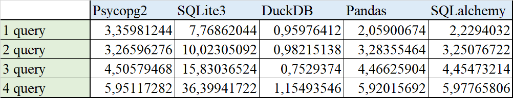
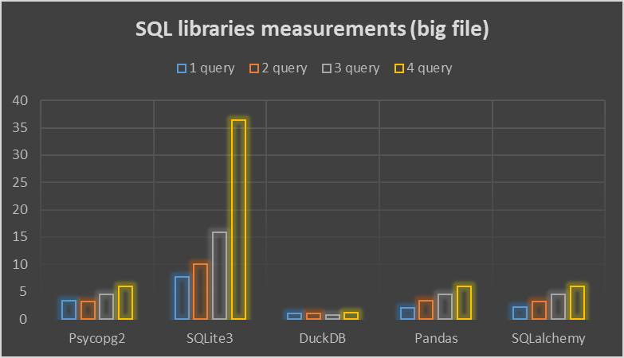

# Lab_work 'Benchmark "4 queries"'

## Оглавление

- [Оглавление](#оглавление)
- [1. О бенчмарке](#1-о-бенчмарке)
- [2. Измеряемые запросы](#2-измеряемые-запросы)
- [3. О работе кода](#3-о-работе-кода)
  - [3.1 Иснтрукция по запуску кода](#31-инструкция-по-запуску-кода)
  - [3.2 Основной скрипт](#32-основной-скрипт)
  - [3.3 Результаты запусков](#33-результаты-запусков)
  - [3.4 О библиотеках](#34-о-библиотеках)
- [4. Вывод](#4-вывод)

***

## 1. О бенчмарке

`Бенчмаркинг баз данных` - это проверенный и четко определённый метод анализа и сравнения характеристик производительности баз данных или систем управления базами данных (СУБД). 
**_Основные задачи бенчмарка_:**
* **_<ins>Оценка производительности:</ins>_** помогает оценить скорость работы системы, ПО или компонентов.
* **_<ins>Сравнение систем:</ins>_** позволяет сравнивать производительность разных систем или компонентов в одинаковых условиях.
* **_<ins>Измерение улучшений:</ins>_** позволяет оценить эффективность изменений, таких как обновления программного или аппаратного обеспечения.
* **_<ins>Стандартизированные тесты:</ins>_** предоставляет набор стандартизированных тестов для объективного сравнения производительности.
* **_<ins>Определение базовой производительности:</ins>_** служит отправной точкой для понимания производительности системы и ее способности справляться с задачами.
* **_<ins>Принятие решений:</ins>_** помогает принимать обоснованные решения на основе количественных данных о производительности.

В данной работе был рассмотрен и написан на языке программирования `Python` один из таких бенчмарков. Его название - `4 QUERIES`. Для его написания были задействованы следующие библиотеки. К ним же и были применены запросы.

1. [Psycopg2](https://www.psycopg.org/docs/)
2. [SQLite3](https://docs.python.org/3/library/sqlite3.html)
3. [Pandas](https://pandas.pydata.org/docs/)
4. [Duckdb](https://duckdb.org/docs/)
5. [SQLalchemy](https://docs.sqlalchemy.org/en/20/)

## 2. Измеряемые запросы

1. Этот запрос выполняет подсчёт кол-ва записей в таблице `trips` для каждого уникального значения столбца `VendorID` и группирует результаты по типу такси (`VendorID`).

```SQL
SELECT "VendorID", COUNT(*) FROM "trips" GROUP BY 1;
```

2. Этот запрос выполняет вычисление среднего значения стоимости поездки (`total_amount`) для каждого уникального значения числа пассажиров (`passenger_count`) в таблице `trips`.

```SQL
SELECT "passenger_count", AVG("total_amount") FROM "trips" GROUP BY 1;
```

3. Этот запрос извлекает информацию из таблицы `trips` о кол-ве пассажиров (`passenger_count`), годе по времени взятия такси (`tpep_pickup_datetime`), и подсчитывает кол-во записей, соответствующих каждому уникальному значению комбинации числа пассажиров и года взятия такси.

```SQL
SELECT "passenger_count", EXTRACT(year FROM "tpep_pickup_datetime"), COUNT(*)
FROM "trips" GROUP BY 1, 2;
```

4. Этот запрос извлекает информацию из таблицы trips о кол-ве пассажирор (`passenger_count`), годе по времени взятия такси (`tpep_pickup_datetime`), округлённой дистанции поездки (`trip_distance`) и подсчитывает кол-во записей для каждой уникальной комбинации этих параметров. Результаты сортируются по году взятия такси в порядке возрастания, а кол-во записей в каждой группе упорядочивается по убыванию.

```SQL
SELECT "passenger_count", EXTRACT(year FROM "tpep_pickup_datetime"), ROUND("trip_distance"),
COUNT(*) FROM "trips" GROUP BY 1, 2, 3 ORDER BY 2, 4 DESC;
```

## 3. О работе кодв

### 3.1 Инструкцию по запуску кода

1. Проверьте, все ли библиотеки у вас установлены. При необходимости используйте команду `pip install` + название одного из модулей;
2. Склонируйте репозиторий и создайте папку для храниния исходников и файлов `.db`;
3. Скачайте исходники по [ссылке](https://drive.google.com/drive/folders/1usY-4CxLIz_8izBB9uAbg-JQEKSkPMg6) и поместите их в папку c данными (в исходных файлах содержится ошибка - два одинаковых столбца. Чтобы она не возникла, последний столбец `Airport_fee` был удалён);
4. Чтобы настроить запуск программы, откройте файл `config.py` (ниже его скрипт) и поправьте все необходимые данные;
5. Чтобы выполнить код, откройте файл `main.py` и запустите его;

#### Config.py

```py
# Information to connect to PostgreSQL
username = ""
password = ""
hostname = ""
port = ""
name_database = ""

# Information about queries
count_queries = 4
attempts = 20

queries = [
    """SELECT "VendorID", count(*) FROM "trips" GROUP BY 1""",
    """SELECT "passenger_count", avg("total_amount") FROM "trips" GROUP BY 1""",
    """SELECT "passenger_count", extract(year from "tpep_pickup_datetime"), count(*) FROM "trips" GROUP BY 1, 2""",
    """SELECT "passenger_count", extract(year from "tpep_pickup_datetime"), round("trip_distance"), count(*) FROM "trips" GROUP BY 1, 2, 3 ORDER BY 2, 4 desc""",
]

queries_sqlite = [
    """SELECT "VendorID", count(*) FROM "trips" GROUP BY 1""",
    """SELECT "passenger_count", avg("total_amount") FROM "trips" GROUP BY 1""",
    """SELECT "passenger_count", STRFTIME('%Y', "tpep_pickup_datetime"), count(*) FROM "trips" GROUP BY 1, 2""",
    """SELECT "passenger_count", STRFTIME('%Y', "tpep_pickup_datetime"), round("trip_distance"), count(*) FROM "trips" GROUP BY 1, 2, 3 ORDER BY 2, 4 desc""",
]

# Information about data
data_folder = ""  # folder name
dataset = ""  # file name with data

# Flags to measure queries for library
SQLITE3 = False
PANDAS = False
PSYCOPG2 = False
DUCKDB = False
SQLALCHEMY = False

```

### 3.2 Основной скрипт

```py
import psycopg2
import pandas
from sqlalchemy import create_engine
import sqlite3

from psycopg2_lib import psycopg_queries
from sqlite_lib import sqlite_queries
from duckdb_lib import duckdb_queries
from pandas_lib import pandas_queries
from sqlalchemy_lib import sqlalchemy_queries
from config import *

# filling the database in Postgres
data = pandas.read_csv(f"{data_folder}/{dataset}")
data["tpep_pickup_datetime"] = pandas.to_datetime(data["tpep_pickup_datetime"])
data["tpep_dropoff_datetime"] = pandas.to_datetime(data["tpep_dropoff_datetime"]) 
data = data.rename(columns={"Unnamed: 0": "id"})
data = data.drop(columns=["Airport_fee"])

path = f"postgresql://{username}:{password}@{hostname}:{port}/{name_database}"
engine = create_engine(path)
data.to_sql("trips", engine, if_exists="replace", chunksize=10000)
engine.dispose()

# creating SQLite database
connection = sqlite3.connect(f"{data_folder}/postgres.db")
data.to_sql("trips", connection, if_exists="replace", chunksize=10000)
connection.close()

# running queries and getting results
if PSYCOPG2:
    print("Psycopg2 measurements: ", *psycopg_queries(), end='\n\n')

if SQLITE3:
    print("SQLite3 measurements: ", *sqlite_queries(), end='\n\n')

if DUCKDB:
    print("DuckDB measurements: ", *duckdb_queries(), end='\n\n')

if PANDAS:
    print("Pandas measurements: ", *pandas_queries(), end='\n\n')

if SQLALCHEMY:
    print("SQLalchemy measurements: ", *sqlalchemy_queries(), end='\n\n')
```

Основной скрипт `main.py` содержит всю информацию, необходимую для запуска. В этом же файле производится подгрузка всех таблиц в базы данных с помощью функций `pandas` таких как `read_csv` (для чтения данных из исходника) и `to_sql` (для записи данных в PostgreSQL и SQLite). Далее в зависимости от выставленных флагов запускаются функции для каждой библиотеки, реализованной в отдельном файле `.py` в той же папке `src`. После выполнения все результаты выводятся в консоль с помощью функции `print`. Тестирование одного запроса проводилось **15 раз** ([запросы](#2-измеряемые-запросы)). Для представления данных в интерактивном виде были созданы графики в `Excel`.

### 3.3 Результаты запусков

1. Измеренное время для маленького файла, таблица + график (`nyc_yellow_tiny.csv`)





2. Измеренное время для большого файла, таблица + график (`nyc_yellow_big.csv`)






### 3.4 О библиотеках

#### Psycopg2


**Psycopg2** - это широко используемая библиотека Python, предназначенная для взаимодействия с базами данных _PostgreSQL_. Библиотека облегчает подключение к базе данных PostgreSQL и позволяет выполнять широкий спектр операций манипулирования данными, включая вставку, модификацию и удаление данных. Кроме того, psycopg2 поддерживает извлечение данных из базы данных, предоставляя возможности для анализа и других действий, связанных с данными. Он используется в большинстве фреймворков Postgres, активно поддерживается и при всём этом обладает многопоточностью. По скорости работы уступает только DuckDB, но при этом показывает хорошие результаты на большом файле (по сравнению с sqlite3). В целом, весьма удобная и понятная библиотека для работы с БД. 

При работе с модулем я использовала следующее:
* Функция библиотеки `connect` (обеспечивает подключение к экземпляру базы данных PostgreSQL и возвращает объект подключения);
* Класс `cursor` (позволяет взаимодействовать с БД);
* Метод cursor `execute` (выполняет любую операцию или запрос к базе данных);

#### SQLite3


Немного слов о SQLite. `SQLite` - это компактная и легкая встраиваемая база данных, которая позволяет хранить и управлять данными прямо внутри приложения. Её простота в использовании и широкая поддержка делают прекрасным выбором для различных проектов, включая веб-приложения, мобильные приложения и многое другое. Использование же SQLite в Python имеет мн-во преимуществ, среди которых можно выделить хранение данных в локальном файле `.db`, а также поддержку стандартных для SQL операций.

Библиотека же **sqlite3** также весьма проста в использования. Она предоставляет пользователю большой спектр понятных функций для работы с данными. Сам функционал похож с psycopg2, но отсутствие необходимости подключаться к PostgreSQL несколько облегчает работу. По скорости же выполнения запросов данный модуль показывает самые худшие показатели.

При работе с модулем я использовала следующее:
* Метод `сonnect`, который соединяет пользователя с базой данных (файл с расширением `.db`);
* Объект `cursor`, позволяющий взаимодействовать с БД;
* Метод cursor `execute`, который выполняет SQL-запросы;

#### DuckDB


Немного слов о DuckDB. **DuckDB** представляет собой SQL-встраиваемая `OLAP` СУБД. Это реляционная СУБД, поддерживающая SQL. DuckDB специально создана для решения задач аналитики и поддержки рабочих нагрузок аналитических запросов для работы с большими объемами данных, что отражается в ее высокой производительности. `DuckDB`, как и SQLite, не имеет серверного программного обеспечения, которое нужно устанавливать, обновлять и поддерживать. Модуль же `duckdb` представляет собой библиотеку Python, предназначенную для взаимодействия с базой данных DuckDB и файлами .db. Этот модуль обеспечивает пользователям Python возможность подключаться к базе данных, выполнять различные запросы, вставлять, изменять и удалять данные, а также извлекать информацию. Среди всех библиотек она показалась мне самой удобной в использовании и наряду с этим самой быстрой по результатам запросов, операжая других в несколько раз.

При работе с модулем я использовала следующее:
* Метод `сonnect`, который соединяет пользователя с базой данных (файл `.db`);
* Объект `cursor`, позволяющий взаимодействовать с БД;
* Метод cursor `execute`, который выполняет SQL-запросы;


#### Pandas


Модуль **Pandas** для Python представляет собой мощный инструмент для обработки и анализа данных, где работа с ними строится поверх библиотеки `NumPy`. Он предоставляет высокоуровневые структуры данных и функции, которые значительно упрощают работу с табличными данными. Pandas позволяет выполнять различные операции: _чтение и запись данных из различных источников, фильтрацию, сортировку, группировку, объединение и индексацию данных._ Библиотека также предоставляет возможности для построения графиков, визуализации и анализа временных рядов. Благодаря удобным структурам данных, таким как `DataFrame`, и обширному набору функций, Pandas является популярным инструментом для проведения анализа данных в среде Python. Кроме того, `Pandas` позволяет работать с различными базами данных (SQLite, PostgreSQL и др.), выступая при этом дополнительным инструментом. Хочется выделить в качестве "+" удобный способ подгрузки информации в базы данных с помощью всего лишь 2-х функций (`read_csv` и `to_sql`). По скорости же pandas проигрывает duckdb и находится примерно на одинаковом уровне с psycopg2, так как в бенчмарке был подключён к PostgreSQL через функцию `create_engine`.

При работе с модулем я использовала следующее:
* функцию `create_engine` для создания импровизированного движка, позволяющего подключиться к базе данных;
* функцию `read_sql` для выполнения SQL-запросов;

#### SQLAlchemy


**SQLAlchemy** - это библиотека Python, которая предоставляет возможности для работы с реляционными базами данных. Она обеспечивает средства для создания `объектно-реляционной модели (ORM)`, а также инструменты для создания и выполнения SQL-запросов. С помощью SQLAlchemy можно создавать классы Python, которые отображают таблицы в базе данных, и взаимодействовать с ними, как если бы это были обычные объекты Python, что облегчает работу с данными. SQLAlchemy также предоставляет возможность создавать и управлять сессиями для выполнения операций в базе данных. Библиотека поддерживает множество различных баз данных, включая PostgreSQL, MySQL, SQLite и др., что делает её _универсальным инструментом для работы с реляционными базами данных в Python._ Однако в данном бенчмарке применение ORM вовсе не требовалось. Следовательно, нельзя объективно оценить данную библиотеку. По производительности эта библиотека занимает 4 место и держится наравне с psycopg2 и pandas, но всё же уступает им из-за дополнительных накладок на выполнение запросов, что отражается на графиках.

При работе с модулем я использовала следующее:
* Функцию `create_engine` для создания импровизированного движка, позволяющего подключиться к базе данных;
* Метод `execute` у объекта `sessionmaker` для выполнения запросов;

***

## 4. Выводы

Таким образом, в данной проекте был разработан `бенчмарк` для оценки производительности _5 модулей Python_, предназначенных для работы с базами данных. Подытожим работу модулей: 
* Наиболее высокую производительность продемонстрировала библиотека `duckdb`, специально разработанная для эффективной обработки аналитических запросов и работы с большими объемами данных. Её высокая скорость достигается за счёт **векторизации выполнения запросов**, в то время как другие СУБД обрабатывают каждую строку последовательно.
* За DuckDB следует библиотека `psycopg2` для работы с базой данных _PostgreSQL_. Она несколько уступает duckdb в силу реляционной структуры PostgreSQL. Тем не менее, на деле данная СУБД вместе с модулем является весьма оптимизированной и показывает неплохие результаты, которые могли бы быть даже улучшены с помощью различных способов.
* Библиотека `sqlite3` показала наихудший результат по времени, проигрывая другим библиотекам в разы. Это может быть связано с тем, что, несмотря на свою простоту в использовании, работа с SQLite осуществлялась также неоптимизированно. Один из способов улучшения производительности - это _индексация_.
* `pandas` и `sqlalchemy` в данном бенчмарке были подключены к PostgreSQL, вследствие чего показали примерно равный результат. По сравнению с psycopg2 их время несколько больше, что могло произойти в результате дополнительных нагрузок. Тем не менее, данные библиотеки более универсальны и позволяют подключаться к различным базам данных, что не о скажешь о _sqlite3_ и _psycopg2_.

В целом, данное исследование позволило мне увидеть целый ряд способов взаимодействия с базами данных посредством написания кода на `Python`. В заключении хочется сказать, что при работе с каким-либо проектом, взаимодействующим с БД, важно правильно выбрать модуль. Преимуществом является то, чтоэтих модулей большое множество и все они по-своему уникальны и удобны. 